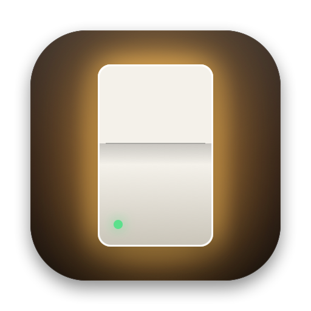
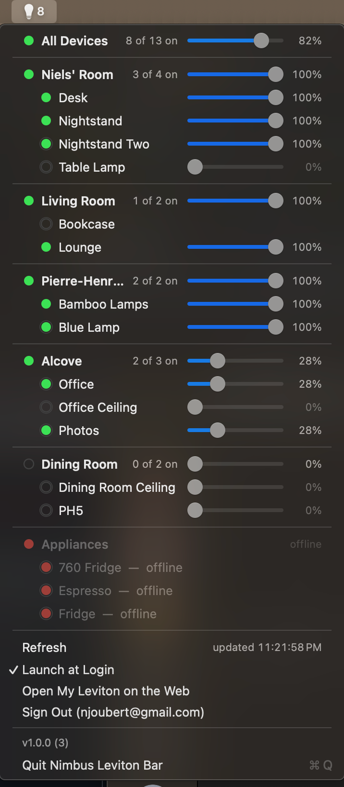

<p align="center">
  
</p>

<h1 align="center">Nimbus Leviton Bar</h1>

<p align="center">
  A macOS menu bar switch for Leviton Decora Smart Wi-Fi dimmers, switches, fan controllers and
  plugs — everything on your My Leviton account, one click away.<br>
  No Dock icon, no window, no dependencies. Swift, SwiftPM, AppKit.
</p>

<p align="center">
  
</p>

```
./build.sh run            # debug build → dist/debug/Nimbus Leviton Bar.app, launch it (add --fg for logs here)
./build.sh stop           # quit it
./build.sh install        # release build → /Applications/Nimbus Leviton Bar.app, launch, add to Login Items
./build.sh uninstall      # remove the Login Item, the app, and its preferences
./build.sh status         # running? installed? login item?
./build.sh app            # release build → dist/Nimbus Leviton Bar.app only
./build.sh dmg            # release build → dist/NimbusLevitonBar-<version>.dmg, drag-to-Applications disk image
./build.sh icon           # re-render docs/icon.png
```

Re-running `install` replaces whatever is in `/Applications` with the current build.

## What it does

**In the bar** — a lightbulb: filled, with the number of devices that are on (`💡 3`), hollow
when everything is off, struck through when not signed in. Hover it for the tally:
`6 of 13 on · 3 offline`.

**In the dropdown** — **All Devices** first, the real master switch: its dot is green when
anything is on, hollow when all is off, red when nothing is reachable or the last request
failed, with the tally beside it; click it to turn every reachable device off (or on). Then
your rooms, in the order the My Leviton app shows them (rooms with no Wi-Fi device are left
out; rooms where nothing is reachable sink to the bottom), and under each room its devices,
unreachable ones last:

| Dot | Meaning |
|---|---|
| 🟢 | on — dimmers also show their level and a slider |
| ⚪ | off |
| 🔴 | My Leviton can't reach it (dropped off Wi-Fi); the row is disabled |

Click a device to toggle it; drag a dimmer's slider and the light is set when you let go (and
switched on, if it was off). An off dimmer reads 0 % with its slider at the bottom, as in the
My Leviton app, and dragging a slider to 0 turns the light off. Click a **room** to switch it
the way the My Leviton app does — through My Leviton's own room switch, which moves every
device in the room; the room row shows `2 of 3 on`. A room with a dimmer in it gets a slider
of its own — as does All Devices — which sets every reachable dimmer in that room (or the
whole home) to one level; it shows the average level of the ones that are on, and 0 switches
them all off.

None of these clicks close the menu, so you can set up a room in one visit. A row flips the
moment you click it and the request follows; if My Leviton says no, the row snaps back and the
reason shows in the status line. Turning a dimmer on sends no level, so the dimmer's own rule
applies (back to its last level, or to its preset — whichever you chose in the My Leviton app).

Below the list: **Refresh**, with when the list was last fetched (or the last error) beside it;
Launch at Login; a link to the web app; Sign Out.

**Keeping up to date** — the list is refreshed when the menu opens (if it is more than a few
seconds old), once a minute in the background so the bar count stays honest, and live over
My Leviton's realtime feed when a switch is changed from the wall, the app, or a schedule.

## Account and privacy

On first launch it asks for your My Leviton email and password — the same login as the My
Leviton app — and keeps them in your login Keychain, never in a preferences file. The session
token My Leviton issues is kept there too, so day to day the password is not sent again; it
is only replayed when a session expires or is rejected. **Sign Out** in the menu removes both.

It talks to `my.leviton.com` and nothing else. There is no analytics, no update check, no
other network traffic.

From the command line the same client is available without the UI (handy for scripts and
for checking what the account returns):

```
.build/debug/NimbusLevitonBar --login you@example.com   # prompts for the password (or takes $MYLEVITON_PASSWORD), saves both
.build/debug/NimbusLevitonBar --print                   # residences and devices, as text
.build/debug/NimbusLevitonBar --set "Kitchen" 40        # a name or an id; on | off | 0–100
.build/debug/NimbusLevitonBar --watch                   # print realtime updates as they arrive
.build/debug/NimbusLevitonBar --get Residences/1/residentialRooms   # any GET, pretty-printed
.build/debug/NimbusLevitonBar --logout
```

## Distribution

`./build.sh dmg` makes the usual disk image: the app, an Applications folder to drag it onto,
and a background that says what to expect — the first launch from `/Applications` registers
the Login Item (once; turning it off later sticks) and asks you to sign in.

Without a Developer ID the build is ad-hoc signed and not notarized, so a copy that arrives
with a quarantine flag (browser download, AirDrop) is refused at first open and has to be
allowed in System Settings › Privacy & Security ("Open Anyway"); a copy that comes over scp or
a USB stick opens straight away. With one, put it in a git-ignored `.signing` file next to
`build.sh` and `app`/`dmg`/`install` sign with it (hardened runtime, timestamped), notarize the
app and the disk image, and staple both:

```
SIGN_IDENTITY="Developer ID Application: Niels Joubert (TEAMID)"
NOTARY_PROFILE=<profile>      # the name you gave: xcrun notarytool store-credentials <profile> --apple-id … --team-id … --password …
```

## Licence

GPL-3.0-or-later. Not affiliated with Leviton; My Leviton is theirs.
